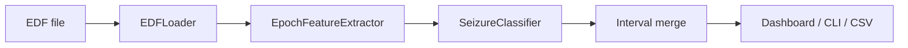

# EpilepsyDetector

Detects whether a seizure occurs in a scalp EEG recording (EDF), and reports the start and end times.

## Overview

Long EEG recordings are tedious to scan by eye. EpilepsyDetector turns that into a simple workflow: load an EDF, extract per-second features across channels, run a trained classifier, and merge consecutive ictal predictions into time windows.

I built this as a proper Python package around an earlier research notebook on CHB-MIT EEG. The notebook was fine for experiments. It was not fine as software. The goal here was to keep the same signal processing and model ideas, but make them installable, testable, and usable from a dashboard or CLI without editing cells.

This repository contains source code, tests and documentation only. It does not include patient EEG or trained model weights. CHB-MIT data must be obtained separately under PhysioNet rules. See [docs/DATA.md](docs/DATA.md).

## Why I Built This

I wanted a small system that answers one question clearly: is there a seizure in this EDF file, and when?

Along the way I needed to practice a few things that notebooks usually skip:

- packaging a real ML pipeline as a library
- keeping training and inference preprocessing identical (no scaler leakage)
- exposing the same pipeline through CLI, Streamlit and FastAPI
- documenting how to use clinical data without putting that data on GitHub

## Key Capabilities

- Classify each 1-second epoch as interictal or ictal
- Merge consecutive ictal epochs into seizure intervals with duration
- Streamlit dashboard for upload, verdict, timelines and CSV export
- CLI: `epilepsy detect`, `epilepsy extract-features`, `epilepsy dashboard`
- Optional FastAPI prediction endpoint for feature files
- Local training helpers (SMOTE + XGBoost) when you have labeled EDFs or feature tables

## How It Works



1. **EDFLoader** reads the recording with MNE (typically 256 Hz scalp EEG).
2. **EpochFeatureExtractor** builds 10 features per channel per second: mean, median, std, max, their ratios to a short baseline window, and FIR band energies (0.5-12.5 Hz and 12.5-25 Hz).
3. **SeizureClassifier** applies the saved MinMaxScaler and RFECV mask, then XGBoost.
4. **Interval merge** turns per-epoch labels into from-to seizure windows.

Training is separate. You only need it when creating or updating `models/seizure_model.joblib`. Detection itself only needs that file and an EDF.

More detail: [docs/ARCHITECTURE.md](docs/ARCHITECTURE.md).

## What This Demonstrates

- End-to-end ML packaging beyond a notebook
- EEG feature engineering with SciPy FIR filters
- Class imbalance handling (SMOTE / RUSBoost)
- Persisting preprocessing state with the model so inference matches training
- A thin UI and CLI over one shared pipeline
- CI with lint and synthetic-data tests (no PhysioNet download required)

## Stack

Python 3.10+, MNE, NumPy, SciPy, scikit-learn, XGBoost, imbalanced-learn, Streamlit, Plotly, Typer, FastAPI.

## Installation

```bash
git clone https://github.com/ShadAhammed/EpilepsyDetector.git
cd EpilepsyDetector
python -m venv .venv
.venv\Scripts\activate          # Windows
# source .venv/bin/activate     # Linux / macOS
pip install -e .
```

For tests and lint:

```bash
pip install -e ".[dev]"
```

Optional local config:

```bash
copy .env.example .env          # Windows
# cp .env.example .env          # Linux / macOS
```

Paths are controlled by `EPILEPSY_DATA_DIR`, `EPILEPSY_MODEL_DIR` and `EPILEPSY_REPORTS_DIR`. Signal and model settings live in [config/default.yaml](config/default.yaml).

## Usage

### Dashboard

```bash
epilepsy dashboard
```

Opens http://localhost:8501 (or use `run_dashboard.bat` on Windows).

1. Point at `models/seizure_model.joblib`
2. Upload an EDF
3. Run analysis
4. Read the verdict, seizure windows and charts

### CLI

```bash
epilepsy detect --edf path/to/recording.edf --model models/seizure_model.joblib
```

Example report:

```
=== Seizure Detection Report ===
Recording: 3600 epochs (3600 seconds)

Result: 1 seizure period(s) detected

  1. Seizure: 2996s to 3036s (epochs 2996 to 3036, duration 40s)
```

### Training a local model

After downloading CHB-MIT EDFs into `data/` ([docs/DATA.md](docs/DATA.md)):

```bash
python scripts/build_chbmit_training.py --data-dir data --train --strategy smote
```

Or from a labeled feature file with an `Out` column (0 / 1):

```bash
python scripts/save_model.py --features features.xlsx --strategy smote
```

## Project Layout

```
src/epilepsy_detection/   Core library (data, features, models, pipeline)
dashboard/                Streamlit app
scripts/                  Local training helpers
config/default.yaml       Sample rate, bands, RFECV settings
docs/ARCHITECTURE.md      Component map
docs/DATA.md              PhysioNet / CHB-MIT setup
tests/                    Synthetic unit and smoke tests
```

Gitignored locally: `data/`, `models/*.joblib`, `notebooks/`, `.env`, `.venv/`.

## Testing

```bash
pytest tests -v
ruff check src tests
```

## Limitations

- Not a medical device. Not for clinical diagnosis.
- No bundled model. You train locally.
- Feature layout expects CHB-MIT-style multi-channel scalp EEG.
- Quality depends on your training set and recording quality.
- Do not redistribute CHB-MIT files. Follow PhysioNet credentialing.

## License

MIT. See [LICENSE](LICENSE).

## Author

Abu Shad Ahammed  
[abu.ahammed@uni-siegen.de](mailto:abu.ahammed@uni-siegen.de)  
Chair of Embedded Systems, Universitat Siegen

If you use CHB-MIT data, cite PhysioNet / Goldberger et al. as required on the [dataset page](https://physionet.org/content/chbmit/1.0.0/).
